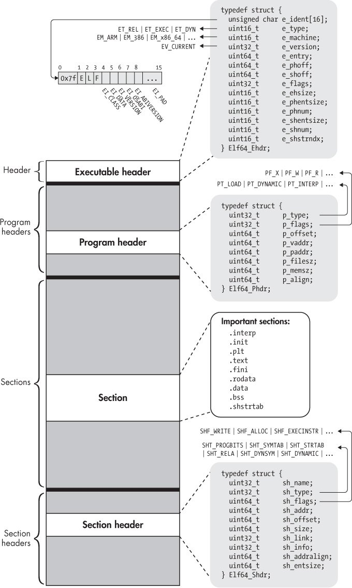

# ft_nm

The goal of this project by school 42 is to reimplement the `nm` CLI Linux tool, for ELF files in `C`.

# Project scope

To do this project, you will have to use a linux docker/VM. You have to work with ELF binaries. You have to handle x86_32, x64, object files, .so

Use the `file` command to view details on a file. You can use the binaries located in your system (`/usr/bin/`, `/usr/lib/`...)

- Executable must be named `ft_nm`.
- Code in `C` and use a `Makefile`
- Output is to be similar to `nm` on the symbols list (order, offset, padding...). Other aspects can have some small differences (filename, etc).
- Your program must behave like the system `nm` on every other aspect. You have to handle errors carefully. In no way can your program quit in an unexpected manner (Segmentation fault, bus error, double free, etc).
- Be cautious. There are many ways to lead your program out of the mapped content, may it be with non-null terminated string, incorrect offsets... Check everything.

### Allowed external functions

- `open()`
- `close()`
- `mmap()`
- `munmap()`
- `write()`
- `fstat()`
- `malloc()`
- `free()`
- `exit()`
- `perror(), strerror()`

---

# nm tool

> nm objfile

### Description

GNU `nm` lists the symbols from object files, objfile.... If no object files are listed as arguments, `nm` assumes the file `a.out`.

For each symbol, `nm` shows:

- The symbol value, in the radix selected by options (see below), or hexadecimal by default.
- The symbol type. At least the following types are used; others are, as well, depending on the object file format. ***If lowercase, the symbol is local; if uppercase, the symbol is global*** (external).

| Symbol Value | Description                                                                                                                                                                                                                                                                                                                                                                                                                                                                           |
|--------------|---------------------------------------------------------------------------------------------------------------------------------------------------------------------------------------------------------------------------------------------------------------------------------------------------------------------------------------------------------------------------------------------------------------------------------------------------------------------------------------|
| A            | The symbol's value is **absolute**, and will not be changed by further linking.                                                                                                                                                                                                                                                                                                                                                                                                       |
| B, b         | The symbol is in the **uninitialized data section** (known as `BSS`).                                                                                                                                                                                                                                                                                                                                                                                                                 |
| C            | The symbol is common. **Common symbols are uninitialized data**. When linking, multiple common symbols may appear with the same name. If the symbol is defined anywhere, the common symbols are treated as undefined references.                                                                                                                                                                                                                                                      |
| D, d         | The symbol is in the **initialized data section**.                                                                                                                                                                                                                                                                                                                                                                                                                                    |
| G, g         | The symbol is in an **initialized data section for small objects**. Some object file formats permit more efficient access to small data objects, such as a *global int variable* as opposed to a large global array.                                                                                                                                                                                                                                                                  |
| i            | For `PE` format files this indicates that the symbol is in a section specific to the implementation of [[DLL]]s. For ELF format files this indicates that the symbol is an **indirect function**. This is a GNU extension to the standard set of ELF symbol types. It indicates a symbol which if referenced by a relocation does not evaluate to its address, but instead must be invoked at runtime. The runtime execution will then return the value to be used in the relocation. |
| N            | The symbol is a **debugging** symbol.                                                                                                                                                                                                                                                                                                                                                                                                                                                 |
| p            | The symbols is in a **stack unwind** section.                                                                                                                                                                                                                                                                                                                                                                                                                                         |
| R, r         | The symbol is in a **read only data** section.                                                                                                                                                                                                                                                                                                                                                                                                                                        |
| S, s         | The symbol is in an **uninitialized data section for small objects**.                                                                                                                                                                                                                                                                                                                                                                                                                 |
| T, t         | The symbol is in the **text (code) section**.                                                                                                                                                                                                                                                                                                                                                                                                                                         |
| U            | The symbol is **undefined**.                                                                                                                                                                                                                                                                                                                                                                                                                                                          |
| u            | The symbol is a **unique global symbol**. This is a GNU extension to the standard set of ELF symbol bindings. For such a symbol the dynamic linker will make sure that in the entire process there is just one symbol with this name and type in use.                                                                                                                                                                                                                                 |
| V, v         | The symbol is a **weak object**. When a weak defined symbol is linked with a normal defined symbol, the normal defined symbol is used with no error. When a weak undefined symbol is linked and the symbol is not defined, the value of the weak symbol becomes zero with no error. On some systems, uppercase indicates that a default value has been specified.                                                                                                                     |
| W, w         | The symbol is a **weak symbol that has not been specifically tagged as a weak object symbol**. When a weak defined symbol is linked with a normal defined symbol, the normal defined symbol is used with no error. When a weak undefined symbol is linked and the symbol is not defined, the value of the symbol is determined in a system-specific manner without error. On some systems, uppercase indicates that a default value has been specified.                               |
| -            | The symbol is a **stabs symbol in an a.out object file**. In this case, the next values printed are the stabs other field, the stabs desc field, and the stab type. Stabs symbols are used to hold debugging information.                                                                                                                                                                                                                                                             |
| ?            | The symbol type is **unknown,** or object file format specific.                                                                                                                                                                                                                                                                                                                                                                                                                       |

- The symbol name.

---

# ELF File

For this part, the notes are compiled from different sources:

- [vx-underground papers | Linux Internals](https://vx-underground.org/Papers/Linux/Internals)
    - [How is an ELF created](https://mini-01-s3.vx-underground.org/samples/Papers/Linux/Internals/2023-06-08%20-%20ELFs%20Story%20Part%201%20-%20How%20is%20an%20ELF%20created.pdf)
    - [ELF Header](https://mini-01-s3.vx-underground.org/samples/Papers/Linux/Internals/2024-02-16%20-%20ELFs%20Story%20Part%202%20-%20ELFs%20Structure%20and%20the%20ELF%20Header.pdf)
- [k3170makan blog | Linux Internals blog](https://blog.k3170makan.com)
    - [Introduction to the ELF Format : The ELF header (Part 1)](https://blog.k3170makan.com/2018/09/introduction-to-elf-format-elf-header.html)
    - [Introduction to the ELF Format : Understanding Program Headers (Part 2)](https://blog.k3170makan.com/2018/09/introduction-to-elf-format-part-ii.html)
    - [Introduction to the ELF Format: Section Headers (Part 3)](https://blog.k3170makan.com/2018/09/introduction-to-elf-file-format-part.html)
- Intezer Blog on ELF file
    - [ELF 101 - Part.1 - Sections and Segments | Intezer blog](https://intezer.com/blog/executable-and-linkable-format-101-part-1-sections-and-segments/)
    - [ELF 101 - Part.2 - Symbols | Intezer blog](https://intezer.com/blog/executable-linkable-format-101-part-2-symbols/)
- Intezer Blog on ELF Malware Analysis
    - [ELF Malware Analysis 101 - Part.2 - Initial Analysis](https://intezer.com/blog/elf-malware-analysis-101-initial-analysis/)

The next resources have not been read yet, I can't assert they're good or not (probably they are):

- [Writing a Linux ELF Binary by Hand | Youtube](https://www.youtube.com/watch?v=JM9jX2aqkog)
- [Understanding ELF file Layout in Memory | Mohit blog](https://chessman7.substack.com/p/understanding-elf-file-layout-in?r=l7k4t&utm_campaign=post&utm_medium=web&triedRedirect=true)
- [Dissection of ELF file | Github](https://github.com/mewmew/dissection)
- [Unpacking ELF files using QiLing framework](https://kernemporium.github.io/posts/unpacking/)
- [Resources Collection related to executable packing (PE, ELF, MACH-O) | Github](https://github.com/packing-box/awesome-executable-packing?tab=readme-ov-file)
- [FreeBSD ELF documentation](https://man.freebsd.org/cgi/man.cgi?elf(5))
- [ELF | OSDev.org](https://wiki.osdev.org/ELF)
- [ELF | Linux Foundation]()https://refspecs.linuxfoundation.org/elf/elf.pdf
- [In-memory-Only ELF execution](https://magisterquis.github.io/2018/03/31/in-memory-only-elf-execution.html)
- [Awesome ELF | TMP.0UT Github resources](https://github.com/tmpout/awesome-elf)
- [Exploring ELF object file formats](https://maskray.me/blog/2024-01-14-exploring-object-file-formats)
- [ELF 101 - part3 | Intezer blog](https://intezer.com/blog/executable-and-linkable-format-101-part-3-relocations/)
- [ELF 101 - part4 | Intezer blog](https://intezer.com/blog/executable-linkable-format-101-part-4-dynamic-linking/)
- https://www.caichinger.com/elf.html
- [r2con2019 - ELF Crafting by ulexec | Youtube](https://www.youtube.com/watch?v=adYOSO0tn9M)
- [ELF Format Cheatsheet](https://gist.github.com/x0nu11byt3/bcb35c3de461e5fb66173071a2379779)

 ## What is an ELF File

An ELF file is not just a binary code that executes on a CPU. It has a specific structure that serves as an identifier, providing information about the file’s properties such as size, type, architecture, data, and more. When an executable file is run on an operating system, the OS reads the file’s structure to determine how to run it. For example, the OS reads the structure to locate the executable codes and then begins running them. To understand how an OS can load and run an ELF file, we need to learn about the ELF file structure. It tells the kernel where to place stuff in memory from the ELF file on disk as well as providing ways to invoke the dynamic loaders functions and maybe even help out with some debugging information.

Before we dive into the details, let’s define what an ELF file is. The ELF file is a binary format used for executable files, shared objects (`*.so`), and core dump files. In this series, we will be discussing 64-bit ELF files, but the structure of 32-bit and 64-bit ELF files is very similar. An ELF file consists of four primary components: an ELF header, some optional program or segment headers, several sections, and a series of optional section headers. The program and section headers are tables for every segment or section, meaning that if we have four sections, we have four section headers.

## How is an ELF File created

When you write code in a native language, like C/C++, and you want to run it, you should compile it. The compiler converts your code into a binary file, depending on your OS.

*Compilation* is the process of translating human-readable source codes like C/C++, into machine codes. Compiling C code involves four phases. Other languages compilation is very similar to C but may have some additional phases.

Let’s see the phases of the compilation process.

#### 1. Pre-processing

In this phase, the compiler collects all .c/.cpp or *sources* files and merges them with their *includes* and places defined values where they had used. The compiler at the preprocessing phase reads the `main.c` file from top to down and *replaces every includes, and definition, with their real sources*.

After preprocessing, all contents of *header* files are merged into the main *source* file.

#### 2. Compilation

In this phase of the compile process, the compiler should *convert the preprocessed code to a low-level language*. This low-level language is assembly.

The compiler converts all C/C++ codes to Assembly language text code. At the end of this phase, we have an assembly code of preprocessed codes.

The compiler converts code to assembly to parse it easily, can do optimization on it and resolve any other necessary issues.

#### 3. Assembling

In this phase, the compiler should *convert the assembly code to the machine code*. In the previous phase, the assembly code was generated, and now the compiler can convert the final version of it to machine code. These machine codes are a series of `0` and `1`.

After this phase, we have a file named, *object file*. An object file is a compiled file, but it needs another phase to become an *executable file*.

Typically, each object file corresponds to one assembly file (compiled file), and each assembly file corresponds to one source file. So if we have three .C/.CPP files, we have three object files for them.

We have an object file `main.o`. The compiler by default sets the name of the *object* file as the *source* file name.

#### 4. Linking

For the last phase, the compiler will call the Linker. In Linux, there's a tool that does the job: `ld`.

The linker links all objects together and makes the final *executable* file. Based on which type of executable file (executable or shared object) you want, the linker decides how to link codes.

We saw that addresses in the object files were not resolved and compiler filled them with some symbolic values. Now the linker knows about all data object files and can replace the symbolic addresses with their real values.

However, some addresses still are unknown for the linker. For example, `printf` and `scanf` functions. `printf` and `scanf` are functions that exist in the shared `stdlib` library (that lives in Linux as a file). The linker will leave addresses with symbolic values and continue its job. The linking of this kind of functions will be done at runtime by a **dynamic linker**.

## ELF Header

The first component of an ELF file is the ELF header, which is located at the beginning of the file. It is just a list of offsets, but it contains important information about the ELF file, including its type, architecture, and the location of other parts within the file. Essentially, the header provides a basic structure of bytes that serves as an introduction to the ELF file.

#### Identifier

The first `16` bytes of the ELF header are ***identifiers***. `4` bytes of this array are the magic value of the ELF file. First byte is `0x7f` and the rest 3 bytes are E, L, and F letters. `[0x7f,’E’,’L’,’F’]`.

As you can see the magic number is the first thing that we see in an ELF file. This magic value is at the beginning of the file due to tools that scan files like the file tool in Linux can detect this file as an ELF. The rest bytes of this 16-byte array are some other values that describe the ELF file better for us.

- `EI_CLASS`: The `5th` byte of this array is the EI_CLASS byte that specifies whether this binary file is 32-bit or 64-bit. The value of `1` is for **32**-bits and `2` for **64**-bits.
- `EI_DATA`: The `6th` byte of this array is EI_DATA. This byte specifies the order of multi-byte values like numbers. In other words, this byte specifies the endian of the binary file. If it is Little-Endian set it to `1` and if be Big-Endian, set it to `2`.
- `EI_VERSION`: The `7th` byte of this array is EI_VERSION. This byte specifies the version of the ELF that is used in this file. The only valid version of the ELF structure until now is `1` and there is no other version for the ELF structure. So it should be 1 always.
- `EI_OSABI`: The `8th` byte of this array is EI_OSABI. This byte specifies the *Application Binary Interface*. In other words, this value is the OS that this binary file could run on. In regular ELF files, this byte is `0x00` which means is for the “UNIX System V” version of Unix-based OSes.
- `EI_ABIVERSION`: The 9th byte of this array is EI_ABIVERSION. This byte specifies the Application Binary Interface version. In the Linux version after 2.5, this byte always has been `0` and useless.
- `Reserved_Bytes`: The other 7 bytes of this array are reserved bytes. They haven’t any used until now and maybe later they will be used for a purpose.

To see the `e_ident` of an ELF file using readelf, use the option `-h`.

#### Type

After the 16-Byte Identifier fields, we have a `2`-Byte value that specifies the **type** of ELF binary. These 2-Byte make some states that specify what type is this binary file, as there are multiple types of ELF files. For example, one of them is Executable ELFs and another one is *Dynamic libraries* or *Shared objects*. This value specifies the type of the binary file.

#### Machine

The next field is **Machine** type. It is a `2`-Byte field that indicates the machine type and instruction sets of the binary file. But what does this mean? `Instruction Set`, or `ISA`, is the architecture and assembly language that is used by the CPU to execute codes. Every CPU vendor has its own architecture and instruction set. For example, the Intel assembly language is different from the ARM assembly. Instructions, call flow, and so on are different. For example, `0x3E` means ELF binary file instruction set is X86-64 which refers to 64-bit architecture, because I use from Intel CPU and I installed a 64- bit Linux OS.


| Value | ISA                         |
|-------|-----------------------------|
| 0x00  | No specific instruction set |
| 0x01  | AT&T WE 32100               |
| 0x02  | SPARC                       |
| 0x03  | x86                         |
| 0x04  | Motorola 68000              |
| 0x05  | Motorola 88000              |
| 0x06  | Intel MCU                   |
| 0x07  | Inte 80860                  |
| 0x08  | MIPS                        |
| 0x09  | IBM System/370              |

(There are 70 entries actually)

#### Version

The next field is the version that is a `4`-Byte value. This field serves the same role as the `EI_VERSION` byte in the Identifier array. Specifically, it indicates the version of the ELF specification that was used when creating the binary. The only true value for this field is `1` (EV_CURRENT).

#### Entry

The next field is important. This `8`-Byte (4-Byte for 32-bit binaries) value indicates the *virtual address of the **Entry Point*** of the ELF binary. The entry point is the address where the execution should start from there. Normally, it points to your `_start`method.

For example, if the entry point of our binary is `0x400000`, the interpreter or dynamic loader transfers the execution to this address after it finishes the loading process and the binary execution starts from here. This value is in *little-endian format*.

#### PhOffset

This `8`-Byte (4-Byte in 32-bit binaries) field indicates the *start offset of the Program Header* of the ELF binary. As you know, the `Program Headers` table is part of an ELF file. However, an ELF file may present in any size. So we can’t guess where is the Program Headers table. Due to this, we need an indicator that specifies it for us. This field is an offset, so its value means the count of bytes from the start of the ELF file. For example, if the value of PhOffset is `0x0000000000000040`, it means that after 0x40 bytes from the start of the file, we reach the beginning of the Program Headers table. This value is in *little-endian format*.

#### ShOffset

This `8`-Byte (4-Byte in 32-bit binaries) field indicates the *start offset of the Section Headers* table of the ELF binary. This field is like the PhOffset field. This value is in *little-endian format*. The `Program Header` and `Section Headers` table don’t need to be located at any particular offset in the ELF file. The only part that should be at a fixed location is the `ELF Header`, which is always at the beginning of the ELF file. If you go back at the beginning, you see that the `Program Header` table is located after the ELF Header, and the Section Headers table is located at the end of the file. But this is not always in this way, because all components of the ELF file can be located at any location, except the ELF Header that is located at the beginning of the file. The reason is clear, we can find all components of the ELF file, so we need an address table at a fixed location, to access it easily and find addresses of other parts of the ELF file. The most important structure of an ELF file is the ELF Header, Because without it, we can find all other parts. The ELF Header is the map of an ELF file.

#### Flags

The next field of the ELF Header is flagged. This `4`-Byte value specifies some flags for the processor that wants to run the ELF. These flags are *CPU specifics*, so their value may differ from one CPU to another. For example, for those binaries that are compiled for running in ARM devices, the compiler may set some flags in this field to tell the ARM CPU, how to run the binary. For X86 binaries, this flag is typically set to `0`.

#### EHSize

The next `2`-Bytes field specifies the *size of the ELF Header in bytes*. But why do we need the size of the ELF Header? This is because when we want to parse the ELF file, we should know how many bytes we should pass to arrive at the next part of the file. This value is usually ***64-Bytes for 64-bit*** and ***52-Bytes for 32-bit format***.

#### PhEntrySize

This is a `2`-Byte field that specifies the *size of the entry of the Program Headers Table*. This size is the same in all other entries of the Program Headers table. So we find out the size of every Header. Now we can traverse Headers in the Program Headers table. But how we can find out how many Headers we should read until the end of the Program Headers table?

#### PhNum

This `2`-Bytes field specifies the *number of entries (headers) that exist in the Program Headers table*. With several entries and the size of one of them, we can calculate how many bytes should be read until arrive at the end of the Program Headers table.

Let’s have an example: The `PhEntrySize` is `0x0038` (56 in decimal). So every Header in the Program Headers table has a size of 56 bytes. Also, the `PhNum` is `0x000B` (11 in decimal). So we have 11 Headers in the Program Headers table. The size of the whole Program Headers table is:

$Program Headers Table = PhEntrySize * PhNum = 0x0038 * 0x000B = 0x268 (616) bytes$

#### ShEntrySize

This is a `2`-Byte field that specifies the *size of one entry of the Section Headers Table*. This size is the same in all other entries of the Section Headers table. The same as PhEntrySize.

#### ShNum

This `2`-Bytes field specifies the *number of entries (headers) that exist in the Section Headers table*. Precisely the same as PhNum.

#### ShStrNdx

In the Sections, we have a table, called `.shstrtab`. This is a dedicated section that contains a *table of null-terminated ASCII strings*, which store the names of all the sections in the binary. The **Section Headers String Table** field is a `2`-Bytes field that contains the index of the `shstrtab` table in the `ELF Section Headers` table. This is needed when some tools want to parse the Section Headers table and need the names of sections. This is useful for the scope of this project!

> For the purpose of this project, ELF Program Headers theory is not needed so I'll skip it. Feel free to read the resources above for more information.

## ELF Section Headers

In every binary file, we have two types of contents: code and data. These contents rest in the binary file in a way that tools like *Linker* and *Loader* can load them and use them in the linking time and also in the run time. All this content (codes and data) rests in the ELF file, in some chunks that are named `Section` in the ELF glossary. These sections do not have any special and predefined structure. It depends on its contents.

Sometimes a Section doesn’t have any special structure and is just a series of bytes of data or codes. A `Section Header` can describe a section and identify it for others. It is a table that describes a section and denotes the properties of the section. They serve almost purely to tag areas of the file with semantic information so other files can find symbols, debug information, meta-data about sections themselves, ...

Sections are mainly used during the linking phase. They serve as a reference point during the linking process. However, not all sections are necessary during runtime, and as a result, the dynamic loader does not load them into memory when running the executable file. Here are the ELF Header fields that hold information about the section header table:

- 7. ShOffset (Section Header Offset)
- 12. ShEntrySize (Section Header Entry Size)
- 13. ShNum (Section Header Entries Number)

ELF files that don’t need linking aren’t required to have a section header table. If no section header table is present, the `e_shoff` field in the executable header is set to `0`. Every section header as fields, described below.

#### sh_name

This value is a `4`-Bytes number that indicates the *index of a string in the Sections Headers String table*. Literally, it is the index of `.shstrtab`. As before said, we have a special section in an ELF file which is named section header string table or `.shstrtab`. All the names of sections are saved in it. This section contains some NULL-terminated strings.

#### sh_type

This is a `4`-Bytes value that indicates the *type of the section*. Every section in an ELF file has a special type. This value is useful for the linker at linking time, to detect the sections that will be relocated.

| Value      | Name              | Meaning                                                                                                                 |
|------------|-------------------|-------------------------------------------------------------------------------------------------------------------------|
| 0x0        | SHT_NULL          | section is NULL. There is no data                                                                                       |
| 0x1        | SHT_PROGBITS      | section contains program data such as machine instruction, constants, opcodes. Section is defined in current object.    |
| 0x2        | SHT_SYMTAB        | section is static symbol table. Symbol is a symbolic name and type for a particular address or offset in the executable |
| 0x3        | SHT_STRTAB        | section is string table. Holds the name of all sections, involving NULL-terminated string.                              |
| 0x4        | SHT_RELA          | section has information about relocation that is used by the linker at the linking phase. With explicit addends         |
| 0x5        | SHT_HASH          | Symbol Hash table for dynamic symbol resolution.                                                                        |
| 0x6        | SHT_DYNAMIC       | section contains information needed for the dynamic linking at loading time                                             |
| 0x7        | SHT_NOTE          | Notes about executable                                                                                                  |
| 0x8        | SHT_NOBITS        | Program space with no data (`.bss`) in disk                                                                             |
| 0x9        | SHT_REL           | section has information about relocation that is used by the linker at the linking phase. Without explicit addends      |
| 0x0A       | SHT_SHLIB         | Reserved                                                                                                                |
| 0x0B       | SHT_DYNSYM        | section is dynamic symbol table. It stores the symbols that are needed at runtime                                       |
| 0x0E       | SHT_INIT_ARRAY    | section contains the array of addresses of constructor functions (run before main).                                     |
| 0x0F       | SHT_FINI_ARRAY    | section contains the array of addresses of destructor functions (run before the executable ends)                        |
| 0x10       | SHT_PREINIT_ARRAY | array of pre-constructors                                                                                               |
| 0x11       | SHT_GROUP         | section group                                                                                                           |
| 0x12       | SHT_SYMTAB_SHNDX  | Extended section indices                                                                                                |
| 0x13       | SHT_NUM           | Number of defined types                                                                                                 |
| 0x60000000 | SHT_LOSS          | Start OS-specifc                                                                                                        |

#### sh_flags

This is an `8`-Byte value (4-Byte in 32-bit) that indicates some additional information about the section. The most important values of this field are:

- **SHF_WRITE**: indicates that the section is writable  at runtime.
- **SHF_ALLOC**: indicates that the contents of the section will load to a memory buffer at runtime.
- **SHF_EXECINSTR**: indicates that the content of the section are some executable instructions, contains some code and should load at runtime.

#### sh_addr

This `8`-Byte (4-Byte in 32-bit) value is the *address of the section in virtual memory*. This value is filled for those sections that will be loaded at runtime, and `0` for the sections that won’t load at running time.

This is for static linker. Some parts of sections will load at memory at the running time, the static linker should know about them to relocate them correctly.

#### sh_offset

This `8`-Byte (4-Byte in 32-bit) value is the *offset of the section in the ELF file*. This field specifies the offset from the beginning of the file to the start of the section.

#### sh_size

This `8`-Byte (4-Byte in 32-bit) value is the *size of the section in bytes*.

#### sh_link

This `4`-Byte value indicates the *index number of an associated section*. Some sections have a relationship with other sections. For example, sections that are in `SHT_SYMTAB`, `SHT_DYNSYM`, or `SHT_DYNAMIC` types, usually have a linked section that is a string table section that contains the symbolic names for the symbols in question.

The `sh_link` field associates this section to another in order to provide important meta-data for its function. So for instance if a section requires a list of other strings to make sense, this field will contain the index of the section that contains that data.

We can see examples of this in the functionality of sections like the `.rela.plt` or `.dynsym` (list of dynamic symbols and their properties) which probably needs to know where the dynamic symbol names are, so therefore would contain some `sh_link` value that would prove helpful in this sense.

#### sh_info

This `4`-Byte value indicates some more information about the section. This value varies depending on the section type. For example, this value in sections with relocation type is the index of the section that should relocate at linking time.

It is no surprise that `.DYNSYM` points to the `.INTERP` section. It holds the path name of the interpreter, which is in charge of the symbol table and function relocations.

#### sh_addralign

This `8`-Byte (4-Byte in 32-bit) value is the *alignment of the section*. Some sections should be mapped with a particular size. So this value indicates the value of alignment. This value must be a *power of two*. For example, if this field is set to `8`, the base address of the section (as chosen by the static linker) must be some multiple of 8. The values `0` and `1` are reserved to indicate no special alignment needs.

#### sh_entsize

Some section, such as symbol tables or relocation tables, contain a table of well-defined data structures. The sh_entsize field indicates the *size in bytes of each entry in the table*. When the field is unused, it is set to `0`.

With readelf tool we can see all section headers.

There are 30 section headers (0 to 29). The first section is for a NULL section with index `0`. The section headers are identifiers for section, here section header 14 describes the `.text` section. As well, the type of this example is `PROGBITS`, which means it contains program code.

After the address, offset and size, there are the flags (`A` and `X`). This indicates that the section should load in memory at running time and it is an executable. The Link and Information sections are set to `0`, but Alignment is set to `16`. The loader allocates a multiple of 16 for the target memory address in the virtual memory of the process.

## Symbols

In the development process of a program, we often use names to refer to objects in our code, such as *functions or variables* that are used all throughout the program. This information is what is known as the *program’s symbolic information*. Symbolic references in machine code get translated into offsets and addresses on the compilation process.

However, compilers are not limited to machine code generation; they also export symbolic information from source code. Symbolic information is exported in order to improve the interpretation of the generated machine code. The ELF file format has a means to hold this symbolic information and provides an interface for local and external ELF objects to access it.

A wide range of tools interact with symbols to enforce their functionality. One example of these tools are `Linkers`. Linkers usually interact with a `Symbol Table` in order to match/reference/modify a given symbol inside an ELF object at link time. Without Symbols, Linkers would not work, since they won’t know which relocations must take place, and therefore would not have a mechanism to match a given symbolic reference to its corresponding value.

Another example of tools that heavily depend on symbolic information are Debuggers. Without `Symbols`, the process of debugging can become considerably harder or even worthless, especially for projects with massive code bases such as the Linux Kernel. Debugging without symbols implies that one has no ability to identify functions or variables by name among other impediments. This would considerably reduce the features afforded by debuggers.

Interestingly, malware also interacts with symbol tables as an *anti-analysis* mechanism. Symbol Tables can appear to be completely removed from the binary as an attempt to harden the analysis process, or in other cases their String Table entries may be swapped so that symbols will be miss-interpreted.

#### ELF Symbol structure

In the ELF file format, each Symbol is represented as an instance of an `Elfxx_Sym` structure inside a given `Symbol Table`.

The elements of this structure include:
- `st_name` - index in string table of symbol name. If this field is not initialized, then the symbol does not have a name.
- `st_info` - contains symbol bind and type attributes. Binding attributes determine the linkage visibility and behavior when a given symbol is referenced by an external object. The most common symbol binds are the following:
    - `STB_LOCAL`: Symbol is not visible outside the ELF object containing the symbol definition
    - `STB_GLOBAL`: Symbol is visible to all object files
    - `STB_WEAK`: Representing global symbols, but their definition can be overridden.
      The most common symbol types are the following:
    - `STT_NOTYPE`: symbol type is not specified
    - `STT_OBJECT`: symbol is a data object (variable)
    - `STT_FUNC`: symbol is a code object (function)
    - `STT_SECTION`: symbol is a section
      In order to retrieve these fields, a set of bitmasks are used. These bitmasks include:
    - `ELF64_ST_BIND(info)  ((info) >> 4)`
    - `ELF64_ST_TYPE(info)  ((info) & 0xf)`
- `st_other`- information about symbol visibility. Symbol visibility defines how a given symbol may be accessed once the symbol has become part of an executable or shared object. Some common symbol visibilities are the following:
    - `STV_DEFAULT`: for default visibility symbols, its attribute is specified by the symbol’s binding type.
    - `STV_PROTECTED`: symbol is visible by other objects, but cannot be preempted.
    - `STV_HIDDEN`: symbol is not visible to other objects.
    - `STV_INTERNAL`: symbol visibility is reserved.
      The major difference between symbol visibility and symbol binding is that the former is enforced on the host object of a given symbol and applies to any external object referencing it. Symbol binding, on the other hand, is specified by an external object referencing the symbol and is enforced at link-time. In other words, object binding depends on the object referencing the symbol, while symbol visibility depends on how the object containing the symbol was compiled.

  The only relevant contents of this field are its *three last significant bits*. Other bit fields do not contain specific meaning. In order to retrieve visibility information, the following macro is used:
    - `ELF64_ST_VISIBILITY(o)   ((o) & 0x3)`
- `st_shndx`: Every symbol entry within the Symbol Table is associated with a section. This value specifies the section index within the `Section Header Table` associated with the given symbol. Check common value for section type field at sh_type (section type).
- `st_value`: This field specifies the symbol value for a given Symbol Table entry. The interpretation of this field can vary depending on the object type.
    - For _ET_REL_ files, `st_value` holds a section offset. The section in which this offset resides is specified on its `st_shndx` field.
    - For _ET_EXEC_ / _ET_DYN_ files, `st_value` holds a virtual address. If this field contains a value of `0` and the symbol’s section pointed by `st_shndx` has a `sh_type` field of type `SHT_UNDEF`, the symbol is an imported relocation, and its value will be resolved at runtime by the _RTLD_ (_ld.so_).
- `st_size`: Field containing symbol’s size.

#### Symbol and String tables

A single ELF object may contain a maximum of two Symbol Tables. These are `.symtab` and `.dynsym`. The difference between these two instances involves the number and type of symbols they contain.

We refer `.symtab` as the binary’s global Symbol Table, containing all symbol references in the current object. The section `.strtab` is the `String Table` of `.symtab` Symbol Table. String Tables store *null-terminated* strings used to reference objects from a different section. Each String Table contains the exact number of entries as its corresponding Symbol Table. This entails that each string entry at a given index in `.strtab` corresponds to an `Elfxx_Sym` entry at the same index in .`symtab`.

On the other hand, we have `.dynsym` Symbol Table. This Symbol Table only holds symbols needed for _Dynamic Linking_. As an overview, when developing an application, sometimes we’d want to use symbols that don’t reside within the context of our program but are instead defined in external objects such as libraries (`Shared Objects`). _Dynamic Linking_ is the process where the linker tries to dynamically bind those external symbols at runtime in order for them to be referenced safely within the context of a program.

> If a given binary has been stripped (`.symtab/.strtab` have been removed) and this same binary has been compiled so that a subset of its symbols will be dynamically linked, this subset of symbols can be recovered by parsing `.dynsym` table located at `DT_SYMTAB` entry within `PT_DYNAMIC` segment. For dynamically linked executables, `.dynsym` will not be removed even if target binary has been stripped, since it is needed at runtime by the `RTLD` in the process of _Dynamic Linking_.

As with `.symtab`, `.dynsym` has its own string table called .`dynstr`. All the relationships previously covered between `.symtab` and `.strtab` also apply between .`dynsym` and `.dynstr`.


---
# Programmatic ELF



### ELF Header

```C
//Executable header structure
typedef struct {

	unsigned char e_ident[16];  //Identifier aka Magic Number
	uint16_t e_type;
	uint16_t e_machine;
	uint32_t e_version;
	uint64_t e_entry;
	uint64_t e_phoff;  // Program Header Offset
	uint64_t e_shoff;  // Section Header Offset
	uint32_t e_flags;
	uint16_t e_ehsize; // ELF Header Size
	uint16_t e_phentsize;  // Program Header Entry Size
	uint16_t e_phnum;  // Program Header Entries Number
	uint16_t e_shentsize;  // Section Header Entry Size
	uint16_t e_shnum;  // Section Header Entries Number
	uint16_t e_shstrndx; // Index of shstrtab (Elf64_Shdr struct)
} Elf64_Ehdr;
```

### Section Header

```C
// Section header structure
typedef struct {

	uint32_t sh_name; // section name
	uint32_t sh_type; // section type
	uint64_t sh_flags; // section flags
	uint64_t sh_addr;  // section address
	uint64_t sh_offset; // section offset
	uint64_t sh_size; // section size
	uint32_t sh_link; // section link
	uint32_t sh_info; // section information
	uint64_t sh_addralign; // section address align (power of 2)
	uint64_t sh_entsize; // section entry size; 0 if unused
} Elf64_Shdr;
```

### Symbols

```C
// Symbols structure
typedef struct {

	uint32_t st_name;
	unsigned char st_info;
	unsigned char st_other;
	uint16_t st_shndx
	uint64_t st_value
	uint64_t st_size
} Elf64_Sym
```

---
# Program Structure

### Project structure

> ft_nm/
>
>├── hdr/elf.h // ELF struct definitions + constants
> 
>├── src/main.c // Entry point
> 
>├── src/ELFparser.c // File parsing logic
>
>├── src/symbol.c // Logic to extract and print symbols
> 
>└── Makefile

### Main program Flow

```C
//main.c
int main(int argc, char **argv) {
    // 1. Validate arguments (expect one ELF filename)
    // 2. Open file, read content into memory
    // 3. Validate ELF magic bytes
    // 4. Parse ELF header
    // 5. Locate section headers, string table
    // 6. Find symbol table (.symtab) and associated string table
    // 7. Read and interpret symbol entries
    // 8. Print symbol table entries (similar to nm output)
}
```

### Parsing ELF file

In `ELFparser.c`:
- Read the ELF file into memory
- Cast the beginning to `Elf64_Ehdr*`
- Validate the magic number (`e_ident[0..4]`).
- Use `e_shoff`, `e_shentsize`, and `e_shnum` to locate section headers.
- Use `e_shstrndx` to resolve section names (to find `.symtab`, `strtab`, etc)

### Finding sections

Search the section header string table for:
- `.symtab` → the actual symbol table.
- `.strtab` → symbol names

### Parsing symbols

In `symbols.c`:
- Parse `Elf64_Sym` entries from `.symtab`
- Use `st_name` to resolve names from `.strtab`.
- Use `st_info` to determine type and binding (function, object, local, global, ...)
- Use `st_shndx` to detect section placement (e.g. UNDEF)

### Displaying symbols

- Mimic the classic output

```bash
0000000000001139 T main
000000000000112a T _start
	         U printf
```
Use logic to map section index and symbol type to a letter.

### Code snippet

#### Validate argument as a file using fstat()

```C
// Step 1: Open the file
int fd = open(argv[1], O_RDONLY);
if (fd < 0) {
	perror("open");
	exit(1);
}

// Step 2: Get file info
struct stat st;
// if fstat<0, it does not exist
if (fstat(fd, &st) < 0) {
	perror("fstat");
	close(fd);
	exit(1);
}

// Step 3: Ensure it's a regular file
// Non regular file = directory, symbolic link, socket, FIFO, block/char device (/dev/sda or /dev/null)
if (!S_ISREG(st.st_mode)) {
	write(1, "Not a regular file.\n", 21);
	close(fd);
	exit(1);
}
```

#### mmap() and munmap()

```C
//void *mmap(void *addr, size_t length, int prot, int flags, int fd, off_t offset);
// Return pointer to mapped memory. If it returns MAP_FAILED, something went wrong.

unsigned char *data = mmap(NULL, st.st_size, PROT_READ, MAP_PRIVATE, fd, 0);

// addr == NULL -- let the kernel choose the address
// length == st.st_size -- How much to map; it's from fstat()
// prot == PROT_READ -- Memory protection set to READ
// flags == MAP_PRIVATE -- private copy-on-write mapping
// fd == fd -- file descriptor
// offset == 0 -- start offset in file, usually 0

if (data == MAP_FAILED) {
	perror("mmap");
	close(fd);
	ext(1);
}

// Unmapto clean up
munmap(data, st.st_size);
```

## AI-Generated Diagram

```
Step-by-step Flow for `nm`-like Tool
====================================

[1] Read ELF Header (Elf64_Ehdr)
--------------------------------
+---------------------------+
| ELF Header                |
|---------------------------|
| e_shoff     --> Offset to Section Header Table
| e_shnum     --> Number of section headers
| e_shstrndx  --> Index of section name string table (.shstrtab)
+---------------------------+
              |
              v

[2] Parse Section Header Table (Elf64_Shdr[])
---------------------------------------------
+------------------------------------------+
| Section Header Table (array of sections) |
+------------------------------------------+
| Walk through e_shnum entries             |
| For each:                                |
|   - sh_name   (index into .shstrtab)     |
|   - sh_type   (e.g., SHT_SYMTAB, SHT_STRTAB) |
|   - sh_offset (file offset of section)   |
|   - sh_size   (size of section)          |
|   - sh_entsize (entry size)              |
+------------------------------------------+
              |
              v

[3] Locate Important Sections
-----------------------------
+----------------------------+     +----------------------------+
| Section: .symtab (symbols) |     | Section: .strtab (names)   |
|----------------------------|     |----------------------------|
| sh_type  == SHT_SYMTAB     |     | sh_type == SHT_STRTAB      |
| sh_offset --> symbol table |     | sh_offset --> string table |
| sh_size / sh_entsize       |     |                            |
| → number of symbols        |     +----------------------------+
+----------------------------+
              |
              v

[4] Read Each Symbol (Elf64_Sym[])
----------------------------------
+-----------------------------+
| For each Elf64_Sym entry:  |
|-----------------------------|
| st_name  --> offset into   |
|             .strtab        |
| st_info  --> type/binding  |
| st_shndx --> section index |
| st_value --> symbol value  |
+-----------------------------+
              |
              v

[5] Look Up Symbol Name
-----------------------
+------------------------------+
| Use st_name as offset into   |
| .strtab to get symbol name   |
+------------------------------+
              |
              v

[6] Print nm-style Output
-------------------------
Format: VALUE TYPE NAME

Examples:
0000000000001139 T main
000000000000112a T _start
                 U printf

----------------------------------------------
### Symbol Letter Codes (TYPE field in output)

Based on `st_info`, `st_shndx`, and section flags:

- `T` → text/code section (e.g., `.text`)
    
- `D` → initialized data

- `B` → uninitialized data (BSS)
    
- `U` → undefined symbol (`st_shndx == SHN_UNDEF`)
    
- `W` → weak symbol
    
- `t`, `d`, `b` → same as above but **local** (lowercase)
```


